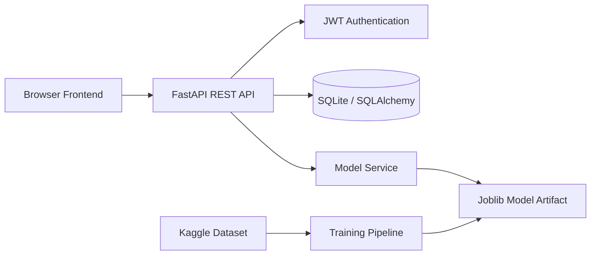

# 🫀 CardioSense Pro — End-to-End ML Health Risk Platform

[](https://github.com/Aadil-Mansuri0/CardioSense-Pro-Fullstack-ML/actions/workflows/ci.yml)

> A full-stack machine-learning application combining a browser UI, FastAPI backend, JWT authentication, per-user prediction history, and a reproducible model-training pipeline.

## 🚀 Project Links

- 💻 **Source:** [GitHub Repository](https://github.com/Aadil-Mansuri0/CardioSense-Pro-Fullstack-ML)
- 📚 **API Docs (local):** `http://127.0.0.1:8000/docs`
- ❤️ **Health Check (local):** `http://127.0.0.1:8000/api/v1/health`

> **Live deployment:** a public live demo is not claimed until the frontend and backend are deployed and verified end-to-end. The repository is deployment-ready, but this README intentionally avoids publishing an unverified URL.

## ✨ What It Demonstrates

- Interactive frontend for health-risk prediction
- FastAPI REST API with automatic OpenAPI/Swagger documentation
- JWT-based authentication and protected prediction history
- SQLAlchemy persistence with SQLite for local development
- ML training and artifact loading with scikit-learn/joblib
- Model metadata and reproducible evaluation results
- Docker-ready backend
- GitHub Actions CI for Python compilation and API smoke checks

## 🧠 Verified Model Evaluation

The checked-in model metrics report contains results from **918 rows** with a 20% test split. The evaluated models include Gradient Boosting, Random Forest, SVM (RBF), and Logistic Regression.

| Model | Accuracy | Precision | Recall | F1 | ROC-AUC |
|---|---:|---:|---:|---:|---:|
| Random Forest | 91.30% | 90.57% | 94.12% | 92.31% | 93.44% |
| Gradient Boosting | 89.13% | 90.20% | 90.20% | 90.20% | 93.61% |
| Logistic Regression | 88.04% | 87.74% | 91.18% | 89.42% | 89.92% |
| SVM (RBF) | 86.41% | 85.98% | 90.20% | 88.04% | 92.12% |

**Important:** these are project evaluation results, not clinical validation. They should not be interpreted as medical-grade diagnostic performance.

## 🏗️ Architecture



## 📁 Project Structure

```text
.
├── CardioSense_Pro_v2.html
├── README.md
└── backend/
    ├── app/
    │   ├── api/routes/
    │   ├── core/
    │   ├── db/
    │   ├── models/
    │   ├── schemas/
    │   ├── services/
    │   └── main.py
    ├── ml/
    ├── data/
    ├── model_artifacts/
    ├── .env.example
    ├── Dockerfile
    ├── Makefile
    └── requirements.txt
```

## ⚡ Run Locally

### 1. Start the backend

```bash
cd backend
python3 -m venv .venv
source .venv/bin/activate
pip install -r requirements.txt
cp .env.example .env
uvicorn app.main:app --reload --host 0.0.0.0 --port 8000
```

Open:

- API: http://127.0.0.1:8000
- Swagger UI: http://127.0.0.1:8000/docs
- ReDoc: http://127.0.0.1:8000/redoc

### 2. Train the model (optional for development)

```bash
python -m ml.download_kaggle_data --dataset-slug fedesoriano/heart-failure-prediction
python -m ml.train
```

The repository also contains a model artifact/metrics report so the application can be inspected without presenting a fabricated benchmark.

### 3. Open the frontend

Serve the repository root with a local static server rather than relying on a `file://` URL:

```bash
python3 -m http.server 5500
```

Then open `http://127.0.0.1:5500/CardioSense_Pro_v2.html`.

## 🐳 Docker

```bash
cp backend/.env.example backend/.env
docker compose up --build
```

## 🔐 Environment Variables

Use `backend/.env.example` as the template. Never commit real secrets.

Important settings include:

- `SECRET_KEY`
- `DATABASE_URL`
- `MODEL_ARTIFACT_PATH`
- `CORS_ORIGINS`

## 🔌 API Surface

Base path: `/api/v1`

- `POST /auth/register`
- `POST /auth/login`
- `GET /auth/me`
- `GET /health`
- `POST /predictions` (authenticated)
- `GET /predictions/history` (authenticated)

FastAPI exposes interactive API documentation at `/docs` when the backend is running.

## 🧪 Quality & CI

Every push and pull request to `main` runs a lightweight backend validation workflow that:

1. Installs the pinned backend dependencies.
2. Compiles the Python application and ML modules.
3. Imports the FastAPI app and verifies required routes.

Workflow: [`.github/workflows/ci.yml`](.github/workflows/ci.yml)

## ⚠️ Educational / Medical Disclaimer

CardioSense Pro is an **educational software and machine-learning project**. It is not a medical device and must not be used for diagnosis, treatment, or clinical decision-making. Predictions are model outputs and should not replace professional medical advice.

## 🔮 Engineering Roadmap

- PostgreSQL deployment for production persistence
- Alembic database migrations
- Automated API test suite
- Containerized frontend + backend deployment
- Model versioning and reproducible training artifacts
- Observability and structured application logging

## 👨‍💻 Author

**Aadil Mansuri** — CSE (AI) student building ML, data-engineering and backend systems.

[GitHub](https://github.com/Aadil-Mansuri0)
